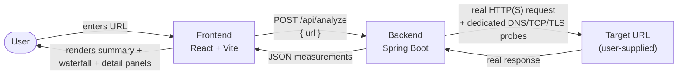

# Netrace

Netrace (originally planned under the working name "Network Black Box") is a developer tool that analyzes the **real, observed** network performance of a public HTTP or HTTPS URL — DNS resolution, TCP connect, TLS handshake, the HTTP request/response itself, time to first byte (TTFB), download time, total duration, status code, resolved IP, and negotiated HTTP version. Every number comes from a real request the backend makes to the target; nothing is estimated, simulated, or synthesized.

## 1. What Netrace Is

You give Netrace a URL. The backend makes a real HTTP(S) request to it using standard Java networking APIs (not an estimate, not a client-side approximation — browsers can't observe raw DNS/TCP/TLS timing at all), and separately runs a few dedicated, one-off diagnostic probes (a fresh DNS resolution, a fresh TCP connect, and for HTTPS a fresh TLS handshake) purely to report what those phases look like in isolation. The frontend renders all of it: a summary, a proportional "waterfall" timeline, and a detail panel per phase.

The one thing Netrace is opinionated about: it will not report a number as more precise, or more related to another number, than it actually is. See [Measurement Limitations](#11-measurement-limitations) below — this matters enough that it shapes the response shape itself, not just the docs.

## 2. Stage 1 Scope

Stage 1's target: a user submits a single public URL, the backend makes a real HTTP(S) request to it, and the frontend displays the observed measurements in a dashboard with a waterfall-style timeline. As of this document, that target is **implemented**:

| Measurement | Status |
|---|---|
| DNS resolution | ✅ |
| TCP connection establishment | ✅ |
| TLS handshake (HTTPS) | ✅ |
| HTTP request/response | ✅ |
| Time to First Byte (TTFB) | ✅ |
| Response download time | ✅ |
| Total observed request duration | ✅ |
| HTTP status code | ✅ |
| Resolved IP address | ✅ |
| HTTP protocol/version | ✅ (HTTP/1.1, HTTP/2 — see [limitations](#11-measurement-limitations) on HTTP/3) |
| Waterfall visualization | ✅ |

Stage 1 explicitly excludes persistence, authentication, multi-URL comparison, and historical tracking — those are later stages, not gaps in this one. See [Current Roadmap](#13-current-roadmap) for what's deliberately not here yet, including a few smaller Stage 1 polish items.

## 3. Architecture



- **Frontend** (`frontend/`) — a React/Vite single-page app. Collects a URL, calls the backend's `/api/analyze` endpoint, and renders the returned measurements. It never talks to the target URL directly.
- **Backend** (`backend/`) — a Spring Boot application. It is the only component that performs the actual network request to the user-supplied URL. It also performs the SSRF validation described in [Security Considerations](#12-security-considerations) before connecting to anything.
- **Target URL** — any public HTTP/HTTPS endpoint the user asks about. Untrusted input, treated as a security-sensitive operation.

Full depth on each of these lives in dedicated docs, not duplicated here:
- [docs/architecture.md](docs/architecture.md) — why measurement happens server-side, component responsibilities.
- [docs/measurement.md](docs/measurement.md) — the complete timing methodology, including exactly why fields can't be freely summed.
- [docs/security.md](docs/security.md) — the full SSRF threat model, what's protected, and disclosed limitations.

## 4. Technology Stack

- **Backend:** Java 21, Spring Boot, Maven (via the `./mvnw` wrapper — no local Maven install needed), Spring WebMVC
- **Frontend:** React 19, JavaScript (no TypeScript), Vite, Tailwind CSS

## 5. Installation

Prerequisites:
- **JDK 21** or newer
- **Node.js** (a recent LTS version) and npm

Clone the repository, then set up each half independently — there is no single top-level install step:

```bash
git clone <this-repository-url>
cd "Network BlackBox"
```

Backend dependencies are fetched automatically by the Maven wrapper the first time you run it (see below); frontend dependencies need an explicit `npm install` (see [Running the Frontend](#7-running-the-frontend)).

## 6. Running the Backend

```bash
cd backend
./mvnw spring-boot:run
```

Starts on `http://localhost:8080`. `POST /api/analyze` is the only application endpoint.

To run the backend test suite (unit and integration tests, including the SSRF-specific suites):

```bash
cd backend
./mvnw test
```

### Configuration

Configurable via `backend/src/main/resources/application.properties`, environment variables, or `--` command-line arguments (standard Spring Boot property sources):

| Property | Default | Controls |
|---|---|---|
| `netrace.analyzer.connect-timeout` | `5s` | Max time to establish a TCP connection to the target URL. Exceeding it surfaces as a `TIMEOUT` error. |
| `netrace.analyzer.request-timeout` | `10s` | Max time for the full request/response exchange once connected, including downloading the response body. Exceeding it also surfaces as a `TIMEOUT` error. Applies per redirect hop, not as one shared budget across a redirect chain. |
| `netrace.analyzer.max-response-size` | `10MB` | Max response body size read before the download is abandoned and `bodyTruncated: true` is reported, rather than buffering an unbounded body. |
| `netrace.analyzer.max-redirects` | `5` | Max number of redirects followed for one analysis. Each hop is individually validated against the SSRF guard before it's followed. Exceeding it surfaces as an `INVALID_RESPONSE` error. |
| `netrace.analyzer.allow-private-targets` | `false` | When `true`, disables the SSRF guard entirely, allowing analysis of loopback/private/link-local targets. Off by default; only appropriate for a controlled internal/testing deployment — see [Security Considerations](#12-security-considerations). |

Durations accept Spring Boot's shorthand (e.g. `5s`, `500ms`, `2m`); `max-response-size` accepts data-size shorthand (e.g. `10MB`, `512KB`). Example override:

```bash
./mvnw spring-boot:run -Dspring-boot.run.arguments=--netrace.analyzer.request-timeout=3s
```

## 7. Running the Frontend

```bash
cd frontend
npm install
npm run dev
```

Starts the Vite dev server on `http://localhost:5173`. The dev server proxies `/api/*` requests to `http://localhost:8080`, so run the backend alongside it (see above) for the Analyze button to work — the frontend never needs its own copy of the backend's base URL.

## 8. Example Request

```bash
curl -X POST http://localhost:8080/api/analyze \
  -H "Content-Type: application/json" \
  -d '{"url": "https://example.com"}'
```

The request body is `{ "url": "<http or https URL>" }` — that's the entire request contract. A missing or blank `url` fails validation before any network activity happens.

## 9. Example Response

A real response captured from a local run against `https://example.com`:

```json
{
  "url": "https://example.com",
  "statusCode": 200,
  "protocol": "HTTP/2",
  "contentLength": null,
  "contentType": "text/html",
  "ttfbMs": 75,
  "downloadMs": 2,
  "bodyTruncated": false,
  "totalTimeMs": 77,
  "probes": {
    "dns": {
      "hostname": "example.com",
      "resolvedIps": ["104.20.23.154", "172.66.147.243", "2606:4700:10:0:0:0:6814:179a", "2606:4700:10:0:0:0:ac42:93f3"],
      "durationMs": 44
    },
    "tcp": {
      "host": "104.20.23.154",
      "port": 443,
      "durationMs": 24
    },
    "tls": {
      "tlsVersion": "TLSv1.3",
      "cipherSuite": "TLS_AES_256_GCM_SHA384",
      "certificateSubject": "CN=example.com",
      "certificateIssuer": "CN=Cloudflare TLS Issuing ECC CA 3,O=SSL Corporation,C=US",
      "durationMs": 132
    }
  }
}
```

`contentLength` is `null` here because this particular response used chunked transfer encoding rather than declaring a `Content-Length` header — that's reported honestly as "unknown," never coerced to `0`. `probes` is HTTP for a plain-HTTP URL, with `tls: null`. See [docs/measurement.md](docs/measurement.md) for what every field means and, critically, which ones can and cannot be added together.

Errors share one consistent shape (`{timestamp, status, error, message}`), regardless of which layer caught the problem. For example, requesting `http://localhost/`:

```json
{
  "timestamp": "2026-09-25T21:31:35.824553Z",
  "status": 400,
  "error": "BLOCKED_TARGET",
  "message": "Refusing to analyze localhost: resolves to a private or reserved address (127.0.0.1)"
}
```

`error` is one of `VALIDATION_FAILED`, `INVALID_URL`, `BLOCKED_TARGET`, `DNS_FAILURE`, `CONNECTION_FAILURE`, `TIMEOUT`, `INVALID_RESPONSE`, or `ANALYSIS_FAILED` (an unexpected server-side error — `message` for that one is always a fixed generic string; the real exception is only logged server-side, never returned to the client).

## 10. Screenshots

Not yet included in this repository. Placeholders for what belongs here once captured:

- **The analyzer form** — empty state, with the placeholder and "Try https://example.com" link visible.
- **A successful analysis** — the summary panel, waterfall visualization, and DNS/TCP/TLS/HTTP detail panels for a real HTTPS URL.
- **The in-progress state** — the loading indicator shown while a request is running.
- **An error state** — e.g. the validation feedback on an invalid URL, or a blocked-target response.

## 11. Measurement Limitations

The full methodology is in [docs/measurement.md](docs/measurement.md); the two points that matter most if you only read one paragraph:

- **`dns`, `tcp`, `tls`, `ttfbMs`, and `downloadMs` cannot be freely summed.** `dns`/`tcp`/`tls` are independent, one-off probes over their own dedicated connections — never the connection the real HTTP request uses. The real request performs its own separate internal DNS+TCP+TLS setup, bundled invisibly inside `ttfbMs`, because the JDK's `HttpClient` exposes no way to observe those sub-steps separately. Adding the probe durations to `ttfbMs` double-counts network setup that happens twice, not once. The **only** guaranteed identity is `totalTimeMs == ttfbMs + downloadMs`.
- **HTTP/3 is not, and cannot currently be, reported.** `java.net.http.HttpClient` (the JDK API this project deliberately uses for real, unapproximated measurements) has exactly two `Version` values, `HTTP_1_1` and `HTTP_2`. This is locked in by a test that will fail to compile if a future JDK ever adds a third value, specifically so that gets a deliberate decision rather than a silent misreport.

The [Waterfall visualization](docs/measurement.md#waterfall-visualization-assumptions) built from these numbers makes the same distinction visually: DNS/TCP/TLS are drawn as independent bars sharing a scale, not chained onto the request timeline, because chaining them would visually assert a single timeline the measurement methodology doesn't support.

## 12. Security Considerations

Netrace's entire purpose is making a real, server-side request to a user-supplied URL — a textbook Server-Side Request Forgery (SSRF) surface. The full threat model, what's protected, and (just as importantly) what's explicitly **not** fully closed is in [docs/security.md](docs/security.md). Summary:

**Protected:** every resolved IP address (not hostname text, which is trivially bypassed) is checked against loopback, private IPv4 (RFC 1918), link-local (including cloud metadata endpoints like `169.254.169.254`), IPv6 unique-local/site-local, wildcard, carrier-grade NAT, broadcast, multicast, and IPv4-mapped-IPv6 ranges — before the dedicated DNS/TCP/TLS probes connect, before the real HTTP request connects, and before following **every** redirect hop individually (redirects previously bypassed all validation entirely; this was the most significant gap found and fixed during the security review). A redirect to a non-`http(s)` scheme is rejected outright.

**Not fully closed — disclosed, not silently assumed:**
- **DNS rebinding.** The pre-flight validation check and the actual connection are two separate DNS resolutions a few milliseconds apart; a narrow window exists where an attacker's DNS server could answer them differently. Fully closing this would need IP-pinning that the standard `HttpClient` API doesn't support without a much larger, JVM-wide custom resolver.
- **No shared timeout budget across a redirect chain** — each hop gets its own full `request-timeout`.
- The OS/JVM DNS resolver itself is trusted; there's no DNSSEC validation.
- `netrace.analyzer.allow-private-targets` is an all-or-nothing bypass, not scoped to a specific host.

## 13. Current Roadmap

**Near-term (Stage 1 polish, not yet done):**
- Real screenshots in place of the placeholders above.
- A frontend automated test suite — none exists yet (no Vitest/Testing Library configured); frontend changes have so far been verified by manual browser testing against the real running backend.
- Narrowing the DNS-rebinding window described above, and covering more of IANA's special-purpose address registry in the SSRF guard, if a concrete need shows up.

**Beyond Stage 1 (explicitly out of scope for now):**
- Persistence / history of past analyses.
- Authentication.
- Multi-URL comparison.
- Historical trend tracking.

See [docs/measurement-phases.md](docs/measurement-phases.md) for how Stage 1's measurements were built up incrementally.

## Project Structure

```
backend/    Spring Boot application (network analysis engine + REST API)
frontend/   React + Vite dashboard
docs/       Architecture, measurement methodology, and security documentation
```

## Engineering Principles

- Measurements reflect real, observed network behavior — never faked or presented as more precise than they are.
- Arbitrary URL fetching is treated as a security-sensitive operation (SSRF-aware).
- Standard library APIs are preferred over extra dependencies.
- No over-engineering: only what Stage 1 needs.
