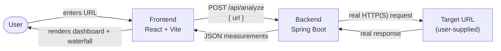

# Architecture

This describes Netrace's **target** Stage 1 architecture. For what is actually implemented today, see [Current Status](#current-status) at the bottom and the README's [Current Limitations](../README.md#current-limitations).

## Components

- **Frontend** (`frontend/`) — a React/Vite single-page app. Collects a URL from the user, calls the backend's `/api/analyze` endpoint, and renders the returned measurements (dashboard + waterfall timeline). It never talks to the target URL directly — browsers can't observe raw TCP/TLS/DNS timing, and CORS would block most cross-origin targets anyway.
- **Backend** (`backend/`) — a Spring Boot application. It is the only component that performs the actual network request to the user-supplied URL, using standard Java networking APIs so the timing data reflects a real observed request rather than a synthetic or client-side estimate.
- **Target URL** — any public HTTP/HTTPS endpoint the user asks about. Untrusted input: the backend treats fetching it as a security-sensitive operation (see [Security](#security)).

## Why measurement happens server-side

Browsers do not expose DNS resolution time, raw TCP connect time, or TLS handshake time to JavaScript (the Resource Timing / Navigation Timing APIs only offer approximations, and are further limited by cross-origin restrictions). To report real, unapproximated measurements, the request has to be made by the backend using lower-level Java networking primitives, not `fetch()` in the browser.

## Security

Because the backend accepts an arbitrary user-supplied URL and fetches it, it is treated as a Server-Side Request Forgery (SSRF) surface: the backend is a trusted service capable of reaching internal/private network addresses that end users normally cannot reach directly. Before the backend makes real outbound requests, this needs to account for restricting or flagging requests to private, loopback, and link-local address ranges. This is called out here rather than deferred silently, per the project's engineering principles.

## Non-goals (Stage 1)

No persistence, no authentication, no multi-URL comparison, no historical tracking. See the [README](../README.md) and [measurement phases](measurement-phases.md) for what Stage 1 does cover.

## Current Status

As of this commit, none of the request flow above is wired up yet:

- The backend has no `/api/analyze` endpoint, controller, service, or DTO — just the generated Spring Boot application skeleton.
- The frontend has the URL input and Analyze button, but the button doesn't call anything, and there's no API client yet.

This document describes the design being built toward, not current behavior.
